# distributed-transaction-example

# Tech Stack
1. Ballerina
2. MySQL Databases

# Usage

1. Create necessary databases, tables and add configurations in Config.toml files.
2. Run all three services.
3. Send a post request to `placeOrder` endpoint with a `OrderRequest`.

// TODO: write more descriptively

# Sequence Diagram

```mermaid
sequenceDiagram
    participant OrderService
    participant Coordinator
    participant PaymentService
    participant InventoryService
 
        OrderService->>Coordinator: Begin Transaction
        Coordinator->PaymentService: Register participant for txn
        Coordinator->InventoryService: Register participant for txn
    
    OrderService->>Coordinator: Make Payment
    Coordinator->>PaymentService: Do Payment
    OrderService->>Coordinator: Update Inventory
    Coordinator->>InventoryService: Update Inventory


    PaymentService-->>Coordinator: Payment Response
    InventoryService-->>Coordinator: Inventory Update Response
    
    rect rgb(86, 86, 86)
        Coordinator->>PaymentService: Prepare
        Coordinator->>InventoryService: Prepare
            PaymentService->>Coordinator: Prepared
            InventoryService->>Coordinator: Prepared
    end
    Note over Coordinator: Makes Decision    
    alt Prepare Successful
        Coordinator-->>PaymentService: Commit Payment
        Coordinator-->>InventoryService: Commit Inventory Update
        OrderService->>OrderService: Send Order Confirmation        
        Coordinator-->>OrderService: Transaction Committed
    else Transaction / Prepare Failed
        Coordinator-->>PaymentService: Rollback Payment
        Coordinator-->>InventoryService: Rollback Inventory Update
        Coordinator-->>OrderService: Transaction Rolled Back
    end
    Coordinator->>OrderService: End Transaction
    
```

